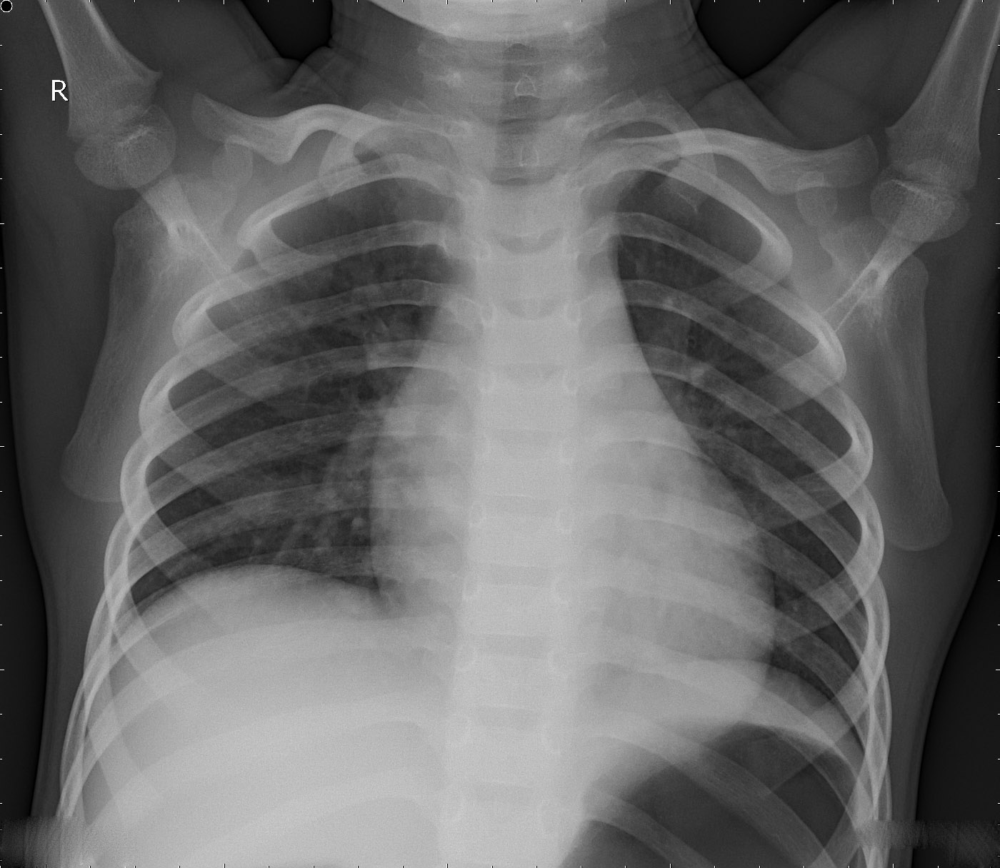
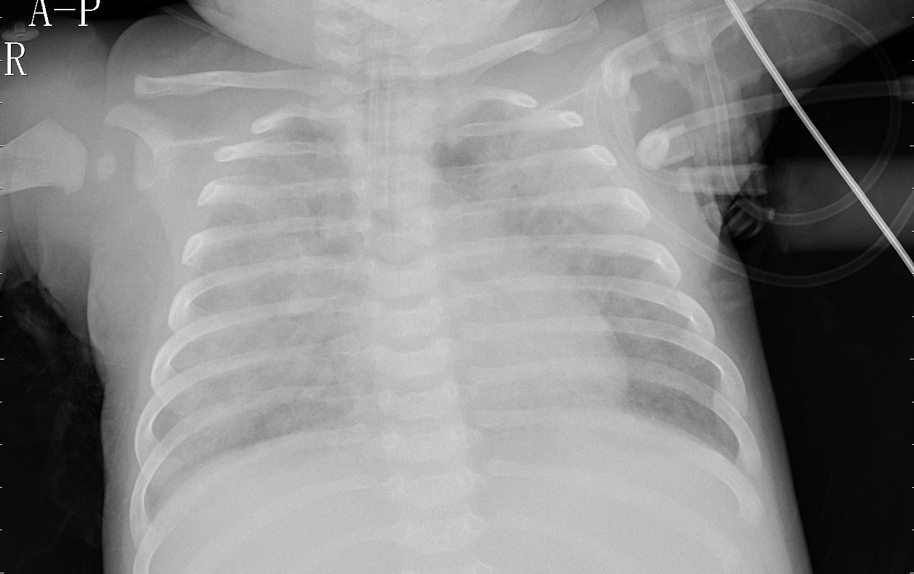
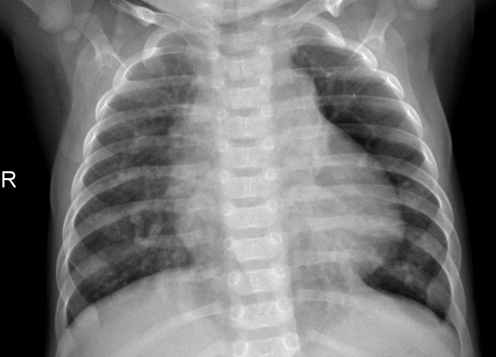

<table><tr>
<td></td>
<td></td>
<td></td> 
</tr></table>

# Diagnosing Pneumonia Using CNNs
**Author:** Evan Holder
Flatiron School - Phase 4 Project

## Repo Contents
* README
* Pneumonia_Classifier.ipynb
* Pneumonia_Classifier-Jupyter-Notebook.pdf
* Diagnosing-Pneumonia-CNN.pdf
* Presentation Link: https://drive.google.com/file/d/1gBzbuWmz_wfz1uRq4lgYccAxKlsjbMGd/view?usp=sharing

## Data
The data are xray images from Mendeley Data. I downloaded the entire dataset from [Kaggle](https://www.kaggle.com/paultimothymooney/chest-xray-pneumonia).

## Introduction and Overview

Pneumonia is a lung infection that affects people of all ages with varying degrees of severity. In fact, the [CDC](https://www.cdc.gov/dotw/pneumonia/index.html) reports that in 2018 about 1.5 million people were diagnosed with pneumonia and more than 40,000 of those people died. For children, pneumonia is the most infectious cause of death worldwide. In 2019, 740,180 children under the age of 5 died of pneumonia according to the [WHO](https://www.who.int/news-room/fact-sheets/detail/pneumonia).  While pneumonia is prevalent and deadly in populations across the world, its also treatable with the proper diagnosis.  For this reason, it's important that the infection is correctly identified so that it can be treated with low-cost and low-tech medication.  

## Business Problem

While pneumonia is diagnosable with symptoms and clinical features, chest x-rays remain the ["gold standard"](https://pneumonia.biomedcentral.com/articles/10.15172/pneu.2014.5/464) for confirming diagnosis of the infection.  Not only are x-rays widely available, but they're also relatively inexpensive and can be reviewed remotely.  With the advent of machine learning, it is possible to further decrease the cost of pneumonia diagnosis through identification of a pneumonia infection by way of convolutional neural networks.  Hospitals or general practices could administer X-rays and subsequently feed the images into a trained CNN to identify pneumonia without the need for a trained physician and/or simply use it to support a diagnosis. Once in use, this CNN would help lower the cost for both healthcare providers and patients themselves.

## Data Understanding

In this section are all import statements. I'll also looked at the layout of the dataset.  The dataset was already split into training/tuning/hold-out sets but disproportionately balanced (89-11-.3%). I moved images between sets to balance the datasets at 70-15-15% (train-tune-holdout).  Additionally I looked at the class balance in each set (training - 81% pneumonia/19% normal, tuning 59% pneumonia/ 41% normal, holdout- 50/50).

Next I displayed an image and it's size.  Our image data are all in grayscale and at a high resolution.  These are important notes to make as it will affect the setup of our CNN.

In this section I also defined some helper functions to set up for modeling. Specifically I defined functions to visualize training results, log evaluation metrics in a dataframe, and a function to actually train each model.

## Modeling

This section will be dedicated to modeling. Each new model will be iteratively named M_0, M_1,... M_n. Models will vary:
* architecture
* optimizers
* number of epochs trained for
* learning rates
* regularization
* image augementation techniques
* image enhancement with histogram equalization

## Evaluation

This section focuses on picking the best model. The goal of the model is predict pneumonia with the highest accuracy.
1) Since I made 30+ models, I first narrowed my selection down to the top 10 models by overall accuracy.  The top 10 models acheived accuracies on the tuning set between 87% and 91% and f1 scores of 0.9 and above. 
2) Next I looked at which model produced more/less false negatives.  In the case of classifying pneumonia, it would be much worse to produce more false negatives than false positives since a false negative means a sick patient not receiving care.  However, false negatives between the top 10 most accurate models did not vary significantly. 
3) Finally, consistency - many of the models' accuracies fluctuated wildly during tuning. I ended up choosing the model which was the most stable and consistent throughout the train/tuning process.  Models that train more consistently and whose tuning accuracies do fluctuate wildly from epoch to epoch are more likely to generalize better on unsee data.

## Final Model Validation

The final model was tested on holdout set and received an overall 92% accuracy, even better than the tuning data. False negatives did increase from the model's test by 2% from the tuning set. The model was 93% precise with pneumonia predictions (correctly classified pneumonia with 93% accuracy) and 90% precise with normal predictions.

Improvement - This model could improve by reducing the 45 false negatives. These are people who will not receive a pneumonia diagnosis and consequently treatment for their infection due to their missclassification by the model.  The model will need to be further improved with either more tuning, architectural changes, more images to train on, or all of the above. Another way to improve the model would be have trained medical profession view the output of the feature maps from the model.  

In this section I have displayed a few of the feature maps from the first convolutional layer of the NN.  A trained eye could review this patterns highlighted by the model and tune the model according to more closely follow pneumonia infections as represented on xrays.

And finally, I took a look at the true positive and true negative rates as compared with a range of decision thresholds. It was concluded that there is a tradeoffs in optimizing for more true positives and a decision threshold of 0.5 was appropriate.

